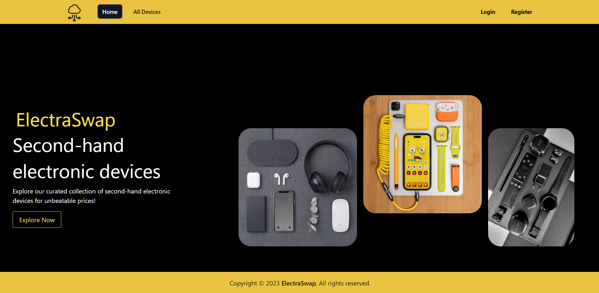
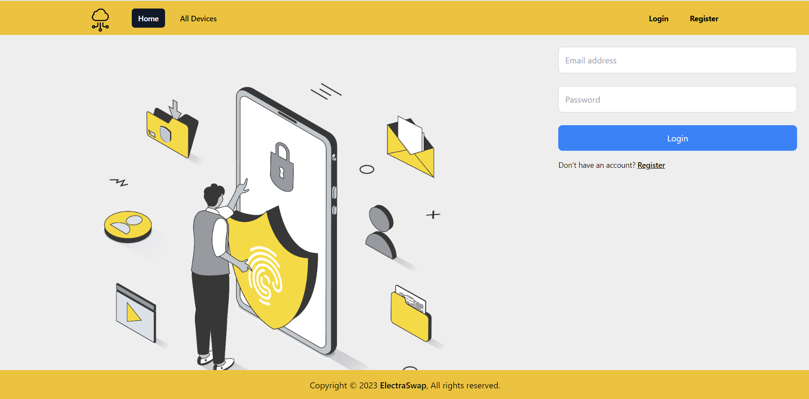
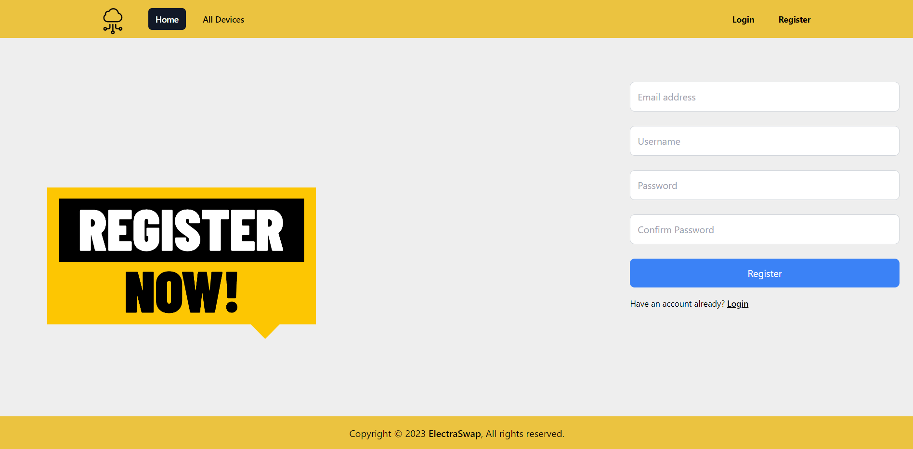
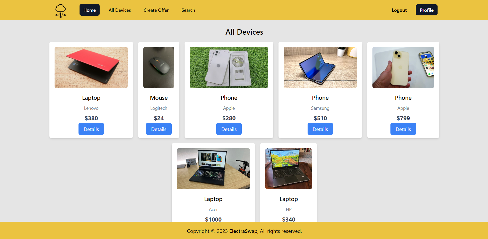
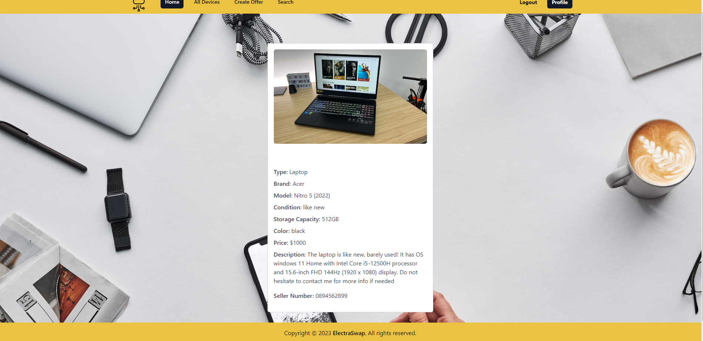

# Ecommerce-SPA-ReactProject
 
 
ElectraSwap is a web application that uses React as a Front-end library 'framework'. This single page application's purpose is to allow its users to browse around and find second-hand or brand new devices on affordable prices. Everyone is able to see all the devices available, however when the user register they will have access to search functionality and also will be able to create and post their own offer.
 The back-end that is being used is softuni's rest-api and the data is preserved in MongoDb 

 ## Steps for local installation and review:
  1. Navigate to Rest-api folder:
   - npm install - command to install all packages and dependencies;
   - npm start -  to start the back-end server;
  2. Navigate to client folder:
   - npm install - command to install all packeges and dependances;
   - npm run dev - to run client React app 

## Libraries I have used in this project
  1. React version 18.2.0
  2. ReactDOM - for routing.
  3. Vite - for building fast and optimized web applications.
  4. Tailwind CSS framework - for better UI.

## Overview

### Each page has navigation and footer.

1. Navigation 
  * NON logged in usesrs:
 

 * logged in users:
 

 2. Footer
 

## Home Page
Home Page is public for all users.
It has an explore more button that redirects the users to All Devices page when clicked.

## Login Page 
Login form requires email and password 

Form Validation 
* both email and passowrd are required
* the password should be at least 5 characters
* the email should be in a valid email format 

## Register Page
Register form requires email, username, password and confirm password

Form Validation

* the validation for the email is the same as in login.
* the username should be at least 5 characters.
* confirm password should match with password which is checked by error handling from the server.

## Create an Offer Page
Create Offer Page allows the logged in user to create their own offer that will be available in the all devices page and also the owner of that offer will be able to edit and delete the offer.

* There are 10 input fileds and each one of them have validation that was made by using yup.
* If an error occurs in the backend it is handled in the CreateDevice component and will be shown as a message to the user.
* When the offer is successfully made the user will be automatically redirected to their profile page where they can see their offers.

## Profile Page
 Each logged in user has Profile Page that shows their username, email and all the offers they have created if any. 

## All Devices Page
Page available for all users and it contains all the created device offers.

## Device Details Page 
* This page is available for all users they can see the characteristics of the device plus the seller's number.
* If this page is opened by the owner of the device they will be able to see edit and delete buttons.

## Device Edit Page 
This page is available for logged in users only that are the creator of the device. It has all the same validators as the ones in the CreateDevice component. Error handling is implemented there as well. If the edit is successful the user will be redirected to the details page od the edited device.

## Search Page
* The search page is available for logged in users only.
* The user can search for a devices based on their brand.
* The user will be able to see the devices of the brand they are looking for if they are any available and then click on their details button so the user can be redirected to the device's details page for more information.